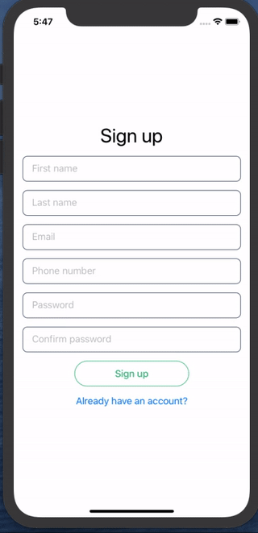
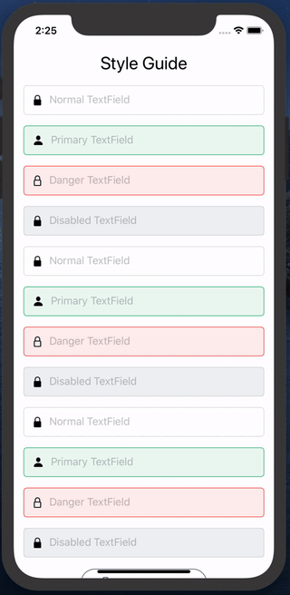

 

[](https://github.com/michaelhenry/KeyboardAvoider/actions)
[](https://cocoapods.org/pods/KeyboardAvoider)
[](https://cocoapods.org/pods/KeyboardAvoider)
[](https://cocoapods.org/pods/KeyboardAvoider)

# ⌨️ KeyboardAvoider {}

A **KeyboardAvoider** for SwiftUI. Inspired by the simplicity of [keyboard_avoider](https://pub.dev/packages/keyboard_avoider) in [Flutter](https://flutter.dev/).

## Features
- Autoscroll to TextField
- Swipe keyboard to dismiss


## Installation

### [Swift Package Manager](https://github.com/apple/swift-package-manager)

Create a `Package.swift` file.

```swift
import PackageDescription

let package = Package(
  name: "TestProject",
  dependencies: [
    .package(url: "https://github.com/michaelhenry/KeyboardAvoider.git", from: "1.0.0")
  ]
)
```

### Cocoapods

```ruby
target 'MyApp' do
  pod 'KeyboardAvoider', '~> 1.0'
end
```

## How to use

```swift
import KeyboardAvoider

KeyboardAvoider {
  // ... Your view with TextFields
}
```

Example:

```swift
KeyboardAvoider {
    VStack {
        TextField("First name", text: self.$firstname)
        TextField("Last name", text: self.$lastname)
        TextField("Email", text: self.$email)
        TextField("Password", text: self.$password)
        TextField("Confirm password", text: self.$password)
        Button("Sign Up") {

        }
        Button("Already have an account?") {

        }
    }
    .padding(.horizontal, 16.0)
}
```

Or in case you don't want to make your view scrollable, you can just only apply the `.avoidKeyboard()` into your main view.

```swift
    VStack {
        TextField("First name", text: self.$firstname)
        TextField("Last name", text: self.$lastname)
        TextField("Email", text: self.$email)
        TextField("Password", text: self.$password)
        TextField("Confirm password", text: self.$password)
        Button("Sign Up") {

        }
        Button("Already have an account?") {

        }
    }
    .avoidKeyboard()
```

## FAQ
- How to remove the extra space between the textfield and the keyboard

  > You can remove it by ignoring the `safe area - bottom`. Please see the [Sample Project](https://github.com/michaelhenry/KeyboardAvoider/blob/d5293c541673bce47f00cdd0ec2f1b604b5341c8/KeyboardAvoider-Example/KeyboardAvoider-Example/ContentView.swift#L45)

 ```swift
  .edgesIgnoringSafeArea(.bottom)
  ```

